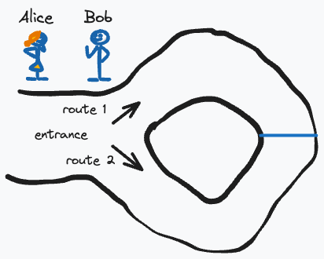
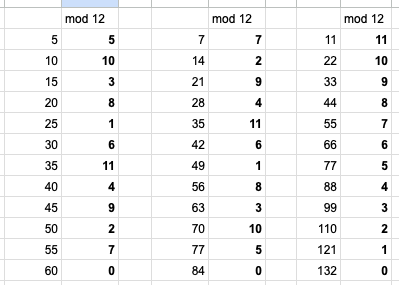

# Week 0 - The Course Primer

### [A Primer for Zero Knowledge Proofs](../week0_course_primer.md#a-primer-for-zero-knowledge-proofs)

Consider the following:

1. What are zero-knowledge proofs?

   Zero-knowledge proof is one can prove he know certain knowledge without revealing the knowledge to a verifier. He does this by generating proofs, and if the verifier verifies the proof to be true, then it means the prover knows the knowledge.

2. What are the principles of soundness, completeness, and zero-knowledge?

   - **Soundness**: It means if the prover knows the secret, then it will be able to generate a proof that is verified to be true.

   - **Completeness**: If a proof is verified to be true, then the prover must know the secret. In practical terms, if a proof is verified to be true, the prover being able to fake a proof is statistically negligible.

   - **Zero-knowledge**: This means that no new knowledge is acquired by the verifier after the proof-interaction with provers. Specifically, Matthiew Green in his post says that a knowledge extractor on the verifier side couldn't extract any new knowledge from the prover.

3. What distinguishes interactive from non-interactive proofs?

   Normally performing a zero-knowledge proof involves many rounds of interaction between verifier giving out a challenge generated from a crypto-secured random number generator and prover reponding back with a proof. This requires the verifier to be always online to interact with provers. Fiat and Shamir comes up with a transformation protocol so that with a decent hash function (e.g. SHA256), it can replace the many interactions between provers and verifiers.

### [Thought Experiments](../week0_course_primer.md#thought-experiments)

Consider the following:

1. Which example did you find most enlightening, and why?

   I find the Sudoku example to be most enlightening. Sudoku example outlined clearly an algorithm on to verify the validity of a solution without revealing the solution out.

2. How do these examples demonstrate the principles of zero-knowledge proofs?

   In all example, first you will find that the computation of verification is a lot "easier" than the computation of finding the solution. Second, verifying the solution will not gain a knowledge to verifier on the problem's solution. The verifier will just know the prover has provided a solution that satisfy all the contraints set by the problem, without knowing anything about the solution.

3. Can you think of any potential applications of these concepts in everyday life?

   It will be great to verify that a valid vote has been cast in a ballot and even verify someone has participated in a ballot, without revealing the voting option that person chooses.

4. Let me try it some days with my parents.

### [Use-Cases and Applications](../week0_course_primer.md#use-cases-and-applications)

Consider the following:

1. Which application of ZKP do you find most intriguing, and why?

   zkEVM is very intriguing to me. Because this means that every low level EVM opcode has been translated to an equivalent zk operation that a ZK proof can be generated. Is there some kind of elegant algorithm to do this or is it a laborous endeavor, converting each opcode to an equivalent circuit one by one?

2. Many. A lot of them involves use cases of decentralized Id.

## [Exercises](../week0_course_primer.md#-exercises)

### Comprehension

Summarize each of the following concepts in a few sentences:

1. **Three-Colouring Graph problem with Hats**: This is a zero knowledge proof protocol to verify the prover indeed know a three coloring solution of a graph. The prover paints out the graph in three colors and then covers all the vertices with hats. The covered solution is shown to the verifier and he can now pick an edge to reveal the color of the two connected vertices. If they have the same color then the prover has failed. If the two vertices have different color then the prover has a slighter more confidence that this is indeed a valid solution. Now the prover/verifier will repeat this process numerous times. The vertices will be repainted again using another 3-color encoding and the verifier randomly choose an edge and reveal the two connected vertices. After numerous times, if the verifier have only revealed vertices with different color, the verifier will have a high confidence that the prover indeed know a 3 coloring solution to the graph.

2. **Ali Baba's Cave analogy**: This analogy is to illustrate Alice indeed know the passphrase to open the cave door. The cave is shaped as followed:

   

   Alice want to show to Bob that she know the passphase to open the blue gate inside the cave, but doesn't want to reveal the passphrase to Bob. What they can do is Alice go inside the cave by picking either route with Bob unknown to Alice choice. Bob then shout at **the entrace** to ask Alice comes out from one of the routes. Now there are three possibilities could happen:
      1. Alice go in from one route and Bob asks Alice to come out from that route. Alice just come out.
      2. Alice go in from one route and Bob asks Alice to come out from the other route. Alice knows the passphrase so she open the gate and come out from Bob requested route, showing that she know the passphrase.
      3. Alice go in from one route and Bob asks Alice to come out from the other route. Alice doesn't know the passphrase so she can only come back out from her original route, showing that she doesn't know the passphrase.

   When #3 happens, we know Alice doesn't know the passphrase. When Alice come out from Bob requested route, there is a 50-50 chance that it is either #1 or #2. But if Bob keeps repeating this process, the probability that **all trials** fall into case #1 approaches zero, and at least one case fall into case #2 or #3, showing if Alice indeed know the cave passphrase.

3. **The difference between interactive and non-interactive proofs**: As shown above, one of the characteristic of (interactive) zero-knowledge proof is that the verifier has to issue many trials (called **challenges** in zkp terminology) in order to gain a high confidence that the prover has the knowledge. This is interactive proof. With non-interactive proofs, the prover can generate a bunch of proofs consecutively all in one-go. The verifier can then verify these proofs altogether in one-go. This is done by [Fiat-Shamir transform](https://www.zkdocs.com/docs/zkdocs/protocol-primitives/fiat-shamir/). The key is to have a decent hash function and it acts as a random oracle that returns a random challenge to the prover.

### Modular Arithmetic

1. 7 mod 13 = **7**
2. 15 mod 13 = **2**
3. (7 + 15) mod 13 = **9**
4. (7 mod 13 + 15 mod 13) mod 13 = **9**

> If the results of the third and fourth calculations match, they follow a "group structure". Can you determine if these do?

Yes, this is a group. By definition a group is:

- a set with an associative and closed binary operator
- an identity element
- every element having an inverse

In the above, the set is [0 ... 12] inclusively and the closed binary operator is (+ mod 13). This set is closed in the sense that the result of the + mod 13 operation always return an element within the set [0 ... 12].

The identity element is 0.

The inverse of an element `i` is `12 - i`.

### Generators

1. What does the term 'generator' mean?

   'generator' means that an element in the group that can generate all other group elements by keep applying the operator to itself.

2. Can you find a generator for this group?

   The generator of the group is **1**.

3. Are there other generators for this group? If yes, what are they?

   The other generator of the group are: **5**, **7**, and **11**. As shown below, all other elements in the group can be generated by keep applying the operator to itself.



### Implementing a Modular Arithmetic Calculator

> Your task is to implement a simple modular arithmetic calculator in JavaScript (or similar high-level language of your choice). The calculator should support three operations: addition, subtraction, and multiplication.
>
> The function modularCalculator should take four parameters:
>
> - A string, op, indicating the operation. It will be one of '+', '-', or '*'.
> - Two integers, num1 and num2, which are the operands for the operation.
> - An integer, mod, which is the modulus.
>
> The function should return the result of performing the indicated operation on num1 and num2, then taking the result modulo mod.
>
> Remember, the result of subtraction could be negative, and in this case, you should add mod to the result to ensure it's positive.

```python
import unittest

def modularCalculator(op, num1, num2, mod):
    match op:
        case '+': return (num1 + num2) % mod
        case '-': return (num1 - num2) % mod
        case '*': return (num1 * num2) % mod
        case _: raise Exception("Unknown operator")

class TestModularCalculator(unittest.TestCase):
    def test_plus(self):
        self.assertEqual(modularCalculator('+', 10, 15, 12), 1)

    def test_minus(self):
        self.assertEqual(modularCalculator('-', 10, 15, 12), 7)

    def test_multiply(self):
        self.assertEqual(modularCalculator('*', 10, 15, 12), 6)

    def test_division(self):
        # Should raise exception
        with self.assertRaises(Exception):
            modularCalculator('/', 10, 15, 12)

# Execution
unittest.main(argv=[''], verbosity=2, exit=False)
```

Running the above returns the following result:

```
test_division (__main__.TestModularCalculator) ... ok
test_minus (__main__.TestModularCalculator) ... ok
test_multiply (__main__.TestModularCalculator) ... ok
test_plus (__main__.TestModularCalculator) ... ok

----------------------------------------------------------------------
Ran 4 tests in 0.005s

OK
```
